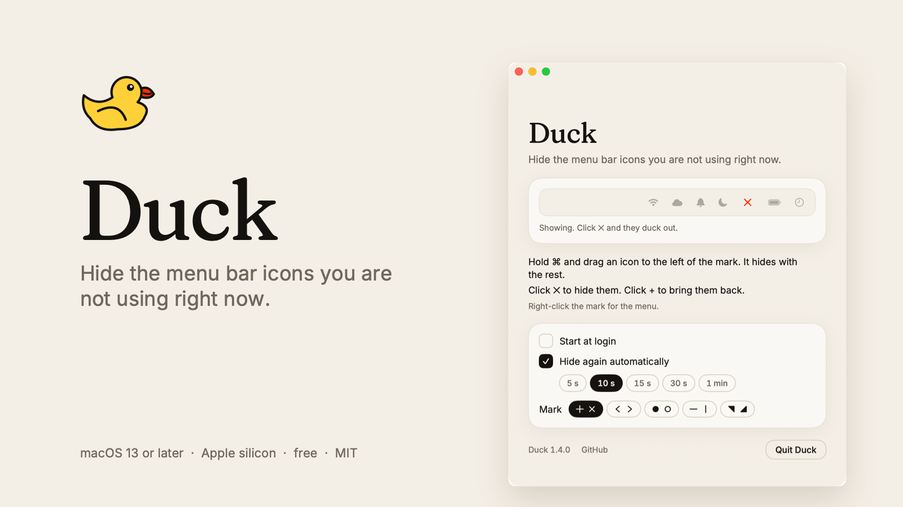
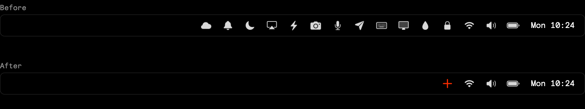

# Tuck



Hides the menu bar icons you are not using right now. Drag them to the left of Tuck's
mark, click it, and they are out of sight. Click again and they are back. Nothing is
removed and nothing is running except one small menu bar app.

**[tuck.hellodigitworks.com](https://tuck.hellodigitworks.com/)** · [Download](https://github.com/hellodigitworks/Tuck/releases/latest/download/Tuck.zip)

One mark and nothing else: a plus while the icons are hidden, an ✕ while they are
showing. It rotates between the two. No line, no gap, nothing else in the bar.

## How it hides



macOS lays out menu bar icons from the right, and an icon that does not fit drops off the
left end. Tuck keeps a few empty items just left of its mark and widens them until the bar
is full, which takes every icon past them out of view. Narrow them again and the icons come
straight back.

Three details, all measured on macOS 27:

- **The width has to go up in steps.** Set it in one jump and macOS shuffles the icons
  sideways and keeps them on screen: a gap where the icons were, nothing hidden. So the
  first hide on a screen walks the width up, then Tuck remembers what worked and opens
  there next time. That is why the icons only slide across the bar once.
- **One item can only take about half the screen.** Past that macOS ignores it, so the
  width is shared across several items instead of piled onto one.
- **An empty status item is 16pt wide, not nothing.** A width constraint on its content
  view holds it open, and that was the gap in the bar. Dropping the constraint and setting
  the window size by hand takes the item down to a single point. The trick comes from
  [Ice](https://github.com/jordanbaird/Ice); its own note is that a future macOS could take
  it away, so if the constraint is missing the items simply rest at 16pt as they used to.

## Get it

One line in Terminal:

```bash
curl -fsSL https://tuck.hellodigitworks.com/install.sh | sh
```

It downloads the latest release, puts `Tuck.app` in `/Applications` and opens it. No
warning appears: macOS only tags files saved from a browser as downloads, and curl is not
a browser. The script is [`site/install.sh`](site/install.sh), a minute to read, and it touches
nothing else.

**Or the zip.** Download it from the [latest release](https://github.com/hellodigitworks/Tuck/releases/latest),
unzip it, and move `Tuck.app` into `/Applications`. Tuck is not signed with an Apple
developer certificate, so the first open takes three clicks:

1. Double-click Tuck. macOS says it could not verify the app. Click **Done**.
2. Open System Settings → Privacy & Security, scroll down, and click **Open Anyway**.
3. Click **Open Anyway** once more. Tuck's mark appears in the menu bar.

On macOS 13 or 14, right-click the app and choose Open instead. Or drop the download tag
with one line in Terminal:

```bash
xattr -d com.apple.quarantine /Applications/Tuck.app
```

Needs macOS 13 or later on Apple silicon. Built and tested on macOS 27; older versions are
untested.

## Use it

Tuck's mark appears in the menu bar, and the first time its window comes with it.

- Hold ⌘ and drag any icon to the left of the mark. It now hides with the rest.
- Click the mark to hide or show them. `+` means hidden, `✕` means showing.
- The very first time nothing hides until you click ✕. After that Tuck starts hidden.
- They hide again on their own after 10 seconds. Change or switch that off in Preferences.
- Right-click the mark for the menu: show, hide, Preferences, Copy Diagnostics, Quit.

**Start at login.** A checkbox in Preferences. Move the app to `/Applications` first so
macOS can always find it.

**Updates.** Tuck asks GitHub once every few hours whether a newer release exists. If one
does, the window and the right-click menu say so with a link. It never downloads anything
on its own.

**If something goes wrong.** Right-click the mark and choose Copy Diagnostics: the Mac,
the screens, every item's position and the recent log land on the clipboard, ready to
paste into an issue. The log itself is at `~/Library/Logs/Tuck.log`.

**From a script, Raycast or Shortcuts:**

```bash
/Applications/Tuck.app/Contents/MacOS/Tuck --toggle
```

## Rebuild from source

```bash
zsh scripts/make-app.sh
```

Add `--install` to copy the finished app into `/Applications`, or `--release` to also write
`build/Tuck.zip`, the file to attach to a GitHub release. Tests:

```bash
zsh scripts/test.sh
```

The pictures above, the social card, the landing page's icons and the shot for hdw lab all
come from one script, so none of them is ever edited by hand:

```bash
zsh scripts/make-images.sh
```

The two typefaces, Fraunces and Inter, are built from their open-licence sources by
`scripts/make-fonts.py`: small static files for the app, woff2 for the page.

## The landing page

`site/` is tuck.hellodigitworks.com: one page, no build step, its own Cloudflare Pages
project. Deploy from that folder:

```bash
npx wrangler pages deploy . --project-name tuck --branch main
```

## Folders

| Folder | What |
|---|---|
| `src/data/` | Settings, start at login, the update check, the log. No screen code |
| `src/app/` | App start-up and the menu bar items |
| `src/ui/` | The mark artwork and the preferences window |
| `scripts/` | Build script, test script, icon generator and image generator |
| `icons/` | Generated app icon |
| `fonts/` | Fraunces and Inter, the two faces the app ships. Generated |
| `site/` | The landing page and the install script, deployed as they are |
| `tests/` | Checks for the settings and update logic |
| `docs/images/` | The pictures in this README, the social card and the lab shot. Generated |
| `build/` | The finished app and the release zip (generated, not committed) |
